---
# Feel free to add content and custom Front Matter to this file.
# To modify the layout, see https://jekyllrb.com/docs/themes/#overriding-theme-defaults

layout: default
title: Captcha Breaking Tutorial
description: This tutorial shows the steps we have used to break simple captchas with image processing and machine learning.

# TODO:
# -- Add refer to image
---
A few months ago [me](https://github.com/CagriUysal/) and [my friend](https://github.com/yalpul) decided to work on a project that breaks annoying captchas
in course registration website. It was a fun project and a nice opportunity to put our knowledge into a real-world example. Throughout the process we have learned a lot,
so I decided to write a tutorial that breaks down the steps we took. I hope this helps someone out there with a similar goal and if you have any suggestions feel free to contact.

Repo for this project is [HERE](https://github.com/CagriUysal/Simple-Captcha-Breaker).

## Tools 
To accomplish our goal we used [python](https://www.python.org/)(3) and following libraries;
* [opencv](https://opencv.org/) and [numpy](http://www.numpy.org/) are used in image processing i.e. denoising the images and separating the digits.
* [pytorch](https://pytorch.org/) used for training the model that will autonomously breaks captchas.

## Creating the Dataset
The very first step of the project is to create a dataset to work on with. Since we wanted to break a specific website's captchas, we downloaded thousands of 
sample images via a click bot. Click bot basically refreshed the page and downloaded the captcha to a folder every time. We could have as many samples we want but decided that
around five thousand would be enough in our purpose. 

<div style="text-align:center"> 
<figure>
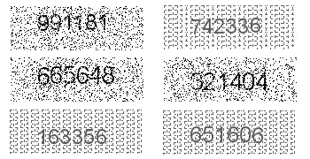 
<figcaption>Fig1. Sample images from dataset</figcaption>
</figure>
</div>

<br/>You can download the dataset [HERE](https://mega.nz/#!2Xo0lYxI!utIihUv511jwJXCti4g35yjhl9ogQxjc2sTkZ2BW-Aw).


After constructing the dataset, here comes the crucial part. Annotating the dataset:).
In every supervised learning problem, we have to annotate(label) our dataset, and I should admit it was the most boring part of the whole thing.
Thankfully we had a saint friend who helped us with this task. Our labels for the dataset is a plain text file and every line has the solution for associated captcha image.
For example line 15 in the text contains solution for "15.jpeg" image in the dataset.

You can download the labels [HERE](https://mega.nz/#!WOJ2SYiZ!kdbwDzo7MguFsuumRsYzQ58PI8yDsoAexkwQyJJdKdQ).

## Denoising and Separating the Digits
After creating our dataset we can experiment on it. At the first glimpse, you can see there are two different types of images. One seems to have a Gaussian noise 
and another one with periodical noise. We call them type1 and type2 images.

<div style="text-align:center"> 
<figure>
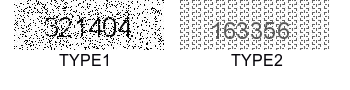 
<figcaption>Fig2. Type1 and Type2 captchas</figcaption>
</figure>
</div>

<br/>So the first image processing task should be determining the type of the given image, and then we can apply denoising on them with an intention to 
separate digits clearly. Separating the digits is a necessity because we can only train our model based on the digits and not the whole images. 
The gif below is a summary of denoising and separation steps.

<div style="text-align:center"> 
<figure>
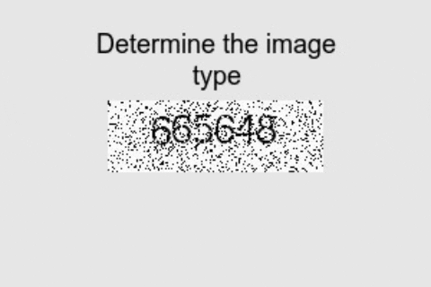 
<figcaption>Gif1. Steps in separating digits</figcaption>
</figure>
</div>

<br/> To determine the type of image we need a general method that distinguishes between types. In this step, one could find multiple solutions that would work fine. 
Our approach was based on image histograms. We saw that type 1 images contain lots of pure black(0 intensity value) in it, so a threshold value
for black pixel count actually worked perfectly.

```python
def whichPattern(image):
	hist = cv2.calcHist([image], [0], None, [256], [0, 256])
	# pattern1 images has almost more than 600 pixels
	# for 0(pure black) intensity, lets set threshold to 500
	thresh = 500	
	if(hist[0, 0] > thresh):
		return 1
	else:
		return 2
```
Above function takes an image as input and determines its type based on its histogram. The solution seems to be naive but works perfectly in this case. 
This [link](https://docs.opencv.org/3.1.0/d1/db7/tutorial_py_histogram_begins.html) provides more information on calcHist function.

The whole point of determining the type was applying an appropriate filter to the image. It has seen that different filters work better on different types.
After investigating couple image processing filters we decided on using median filter for type 1 and gaussian filter for type 2. Both of these filters 
smoothen images for further processing.

```python
# use median blur for pattern1 and gaussian blur for patter2 images as pre-processing
srcImage = cv2.medianBlur(srcImage, 3) if pattern == 1 else cv2.GaussianBlur(srcImage, (3,3), 0)
```

You can find more about medianBlur and GaussionBlur [here](https://docs.opencv.org/3.1.0/d4/d13/tutorial_py_filtering.html).

<div style="text-align:center"> 
<figure>
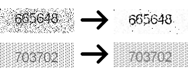 
<figcaption>Fig3. Sample result of smoothing filter for both types</figcaption>
</figure>
</div>

<br/>As we can see in Figure 3, smoothing filters make a great job at reducing the noise (especially for type1), therefore, now we can try binary threshold
to separate content(digits) from the background.  

```python
#obtained through experiment 
pattern1_thresh = 170
pattern2_thresh = 155

thresh = pattern1_thresh if pattern == 1 else pattern2_thresh
ret, threshImage = cv2.threshold(srcImage, thresh, 255, cv2.THRESH_BINARY_INV)
```

Above code uses OpenCV's [threshold](https://docs.opencv.org/3.4/d7/d4d/tutorial_py_thresholding.html) function to separate background and foreground 
of the images. Binary thresholding is one of the simplest method for image segmentation and very straight forward. It compares every pixel with a certain
threshold value, then if the value of the pixel is less then the threshold it sets pixel's intensity value to 0. In our case (see Fig 3.) digits actually have less
intensity values than background so using inverse binary thresholding was appropriate. In this case, pixel values greater than the threshold set to 0(background)
and remaining pixels set to 255(foreground). Each type has its own threshold value and these values selected based on manual inspection of sample images.


<div style="text-align:center"> 
<figure>
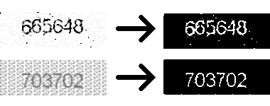 
<figcaption>Fig4. Sample result of binary thresholding</figcaption>
</figure>
</div>

<br/>In Figure 4 we can see thresholding operation gives a binary image that only has black and white pixels. The type2 image seems be completely 
noise free but the type1 image still has white pixel regions that are not part of the digits. Note that these regions relatively smaller than digits.
To delete this noisy parts we can use connected components.

```python
min_connected_len = 15

# get connected components
numLabel, labelImage, stats, centroids = cv2.connectedComponentsWithStats(threshImage, 8, cv2.CV_32S)

# holds if component will be included to foreground
foreComps = [i for i in range(1, numLabel) if stats[i, cv2.CC_STAT_AREA] >= min_connected_len]

# Get binary image after erasing some connected components those areas under the threshold
binaryImage = np.zeros_like(srcImage)
labelImage = np.array(labelImage)
for k in [np.where(labelImage == i) for i in foreComps]:
	binaryImage[k] = 255
```

Using OpenCV's `connectedComponentsWithStats` function we can find `threshImage`'s connected components with stats associated with it. 
We have used [8-connectivity](http://www.imageprocessingplace.com/downloads_V3/root_downloads/tutorials/contour_tracing_Abeer_George_Ghuneim/connectivity.html) in order to 
find connected components of the image. Here, `labelImage` is a matrix same size with the `threshImage` where each pixel of the certain connected component has the value of its own label
(0 being the background) and `numLabel` is the number of connected components. Knowing the labels of connected components we can choose those have areas(number of pixels) greater 
than the `min_connected_len` thanks to `CC_STAT_AREA`. Finally, labels in `foreComps` are added to the foreground in `binaryImage` and other labels discarded(added to background).

<div style="text-align:center"> 
<figure>
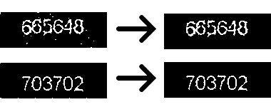 
<figcaption>Fig5. Sample result of discarding connected components whose area under the threshold value</figcaption>
</figure>
</div>

<br/> From Figure 5, we can see connected component analysis made a great job at deleting regions that are not part of the digits. Now we can clip a rectangle that only contains the digits
thus removing the unnecessary background. In order to do that we need to find where do the digits lay in the image.

```python
minCol = 30; # seen that all digits start at 30th column 
			# no need for additional computation

# find the boundaries where digits present in the image 
array = np.array([stats[i, cv2.CC_STAT_LEFT] + stats[i, cv2.CC_STAT_WIDTH]  for i in foreComps])
maxCol = max(array[np.where(array < 125)]) # observed that digits right boundary never exceeds 125th pixel 
									# thus this one prevents false boundaries
# find boundaries in y axis
minRow = min([stats[i, cv2.CC_STAT_TOP] for i in foreComps])
maxRow = max([stats[i, cv2.CC_STAT_TOP] + stats[i, cv2.CC_STAT_HEIGHT] for i in foreComps])

subImage = threshImage[minRow:maxRow, minCol:maxCol]
```

Examining the dataset we saw left boundary of digits starts at 30, so `minCol` is fixed. Right boundary(`maxCol`) is the rightmost pixel in the foreground. This is found by 
adding `CC_STAT_LEFT` and `CC_STAT_WIDTH` which is adding leftmost pixel of the connected component to its width. There is a little hack (`np.where(array < 125`) to prevent false boundaries that occurs
when some noise remained in the image. Upper and lower boundaries are found by similar manner.

<div style="text-align:center"> 
<figure>
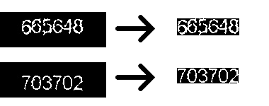 
<figcaption>Fig6. Sample result of extracting boundaries of the digits</figcaption>
</figure>
</div>

<br/>So now we are close to ending of pre-processing, separating digits individually.

```python
# Sub image divided to half in order to segment digit's more precisely
subImage1 = subImage[:, :int(subImage.shape[1]/2)]
subImage2 = subImage[:, int(subImage.shape[1]/2):]

colIncrement1 = subImage1.shape[1] / 3
colIncrement2 = subImage2.shape[1] / 3

# get segmented digits as list
digitList1 = []
digitList2 = []

col1 = 0
col2 = 0
for i in range(2):
	digitList1.append(subImage1[:, int(col1):int(col1+colIncrement1)])
	digitList2.append(subImage2[:, int(col2):int(col2+colIncrement2)])
	col1 += colIncrement1
	col2 += colIncrement2

digitList1.append(subImage1[:, int(col1):])
digitList2.append(subImage2[:, int(col2):])
digitList = digitList1 + digitList2
```

We could divide resulting `subImage` to 6 pieces of equal lengths in order to obtain separated digits. But it has seen that instead of dividing by six right away,
first dividing the image to half and then taking digits gives better results. Above code implements this approach. It first divides the image to half then
each half again divided to three to obtain digits. Results stored in `digitList`. You might wonder why we just didn't take remaining connected components as digits. 
Well, actually we couldn't, because as we can see from Fig7 sometimes there is a gap between a digit's parts(more than 6 connected components), and sometimes digits are touching each other(less than 6 connected
components).

<div style="text-align:center"> 
<figure>
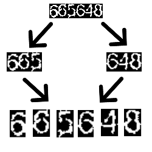 
<figcaption>Fig7. Sample result of separating digits</figcaption>
</figure>
</div>

<br/>Thus we achieved digit separation we could finish pre-processing here and start training our DL model. But when we checked some images we saw
that some parts of the digits shifted to other digits. 

<div style="text-align:center"> 
<figure>
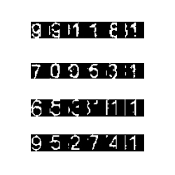 
<figcaption>Fig8. Some wrongly separated digits(Digit parts shifted to next digit)</figcaption>
</figure>
</div>

<br/>Although this phenomenon was rare and most of the images was correctly separated, we wanted to make something about it.

```python
# It is observed that sometimes part of the previous digit shifted to 
# digit that follows it.
# Following prevents it most of the time
for i in range(1, 6):
	# Appy slight closing before finding c.c, sometimes particular digit parts only apart by 1 pixels (fill them to avoid false shifting)
	kernel = cv2.getStructuringElement(cv2.MORPH_CROSS, (3,3))
	closedDigit= cv2.morphologyEx(digitList[i], cv2.MORPH_CLOSE, kernel, 1)

	numLabel, labelImage, stats, centroids = cv2.connectedComponentsWithStats(closedDigit, 8, cv2.CV_32S)
	if numLabel > 2: # consider shifting if there is more than 1(with background its 2)  c.c. per digit
		for j in range(1,numLabel):
			# If it touches left border of the image
			# and it's width doesnt exceed 35 percent of the digit, assume it is a shifting
			if stats[j, cv2.CC_STAT_LEFT] == 0 and stats[j, cv2.CC_STAT_LEFT] + stats[j, cv2.CC_STAT_WIDTH] < 0.35 * digitList[i].shape[1]:
				# find the part that will attach to previous digit
				startCol = stats[j, cv2.CC_STAT_LEFT]
				width_shifted = stats[j, cv2.CC_STAT_WIDTH]
				shiftedPart = digitList[i][:, startCol:startCol+width_shifted]	

				# shift previous image to left while maintain its size 
				# shift amount is width of the shifted-part
				fixedDigit = np.zeros_like(digitList[i - 1])
				fixedDigit[:, 0:fixedDigit.shape[1] - width_shifted] = digitList[i - 1][:, width_shifted:fixedDigit.shape[1]]
		
				# appending shifted part back to previous digit
				fixedDigit[:, fixedDigit.shape[1]-width_shifted:fixedDigit.shape[1]] = shiftedPart[:]
					
				digitList[i - 1] = fixedDigit # replace digit with fixed digit
				
				# remove shifted part from current digit 
				digitList[i][:, 0:width_shifted] = 0
```
Ok. This one seems to be complex, but the idea is very simple. For better understanding let's take a look at Fig9.  

<div style="text-align:center"> 
<figure>
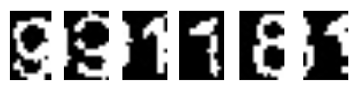 
<figcaption>Fig9. Shifted digits.</figcaption>
</figure>
</div>

<br/> Hmm, first 9's end is shifted to the second nine, second 9's end is shifted to 1... and so on. Fixing this can be achieved by re-shifting the digit parts to the left.
To do that, first, we need to define rules for wrong shifting then take action. The very first thing we need to consider is if there are more than one connected components per separated digit.
(`if numLabel > 2`). This might be true because of shifting or there could be gaps between single digit parts(in Fig7, separated 5 has two c.c). So by only this fact we cannot conclude on wrong shifting exists.
Second thing to consider is shifted part need to always touching to left boundary of the digit image(`if stats[j, cv2.CC_STAT_LEFT] == 0`). In addition to that it is assumed shifted part is 
no more than %35 of the image(`stats[j, cv2.CC_STAT_LEFT] + stats[j, cv2.CC_STAT_WIDTH] < 0.35 * digitList[i].shape[1]`). If the conditions satisfied then shifting to the left is applied.
Let's see this in action in Gif2.

<div style="text-align:center"> 
<figure>
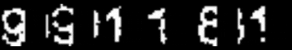 
<figcaption>Gif2. Correcting wrongly separated digits.</figcaption>
</figure>
</div>

<br/> We did our best for separating digits. There might still bad separations but it will be enough to train our DL model.

## Training the Model

Now we can define our model which is going to be trained on our dataset. For this task CNN's are a great choice, they are the kings of image recognition.

```python
import torch.nn as nn
import torch.nn.functional as F

class Net(nn.Module):
    def __init__(self):
        super(Net, self).__init__()
        # convolutional layer (sees 24x14x1 image tensor)
        self.conv1 = nn.Conv2d(1, 3, kernel_size=3)
        # convolutional layer (sees 22x12x3 tensor)
        self.conv2 = nn.Conv2d(3, 3, kernel_size=3)
        # linear layer (20 * 10 * 3 -> 30)
        self.fc1 = nn.Linear(20*10*3, 30)
        # linear layer (30 -> 10)
        self.fc2 = nn.Linear(30, 10)
    def forward(self, x):
        # sequance of convolutional layers with relu activation
        x = F.relu(self.conv1(x))
        x = F.relu(self.conv2(x))
        # flatten the image input
        x = x.view(-1, 20*10*3)
        # 1st hidden layer with relu activation
        x = F.relu(self.fc1(x))
        # output-layer
        x = self.fc2(x)
        return x

```
We are not experienced in NN architecture, but we know how to google :D. Pytorch provides a great [example](https://pytorch.org/tutorials/beginner/blitz/cifar10_tutorial.html) in image recognition so we were basically
playing with the parameters. Let's quickly go over the model. The model contains two convolutional layers and two fully connected layers. First convolutional layer (`self.conv1`) expects
`24x14x1` image tensor, here `24` and `14` are height and width of the image while `1` is the number of channels in the image(our images are grayscale thus 1 channel). 
But why `24x14`? Pytorch's [Conv2d](https://pytorch.org/docs/stable/nn.html#conv2d) excepts images with a fixed shape, i.e. all input images should have the same height and width.
To fix all digits shape before feeding them to model, we calculated the mean height and width of the images, and here comes the `24x14`. 
I believe the second important thing to mention here is figuring out correct parameters for the first fully connected layer. As you can see from the code it takes `20 * 10 * 3` as input tensor's size.
We started with `24x14x1` but why end up with `20x10x3` tensors in convolutional layers? The reason is every time we go through a convolutional layer it shrinks the input size according to 
applied kernel size in the absence of padding. Thus we are applying `3x3` kernel, it shrinks input tensor by 1 from the top, bottom, left and right. So `conv1` gives `22x12x3` tensor as output and
`conv2` gives `20x10x3` as its output. You can find more about the topic [here](http://cs231n.github.io/convolutional-networks/#layers).

Now we are ready to train our model. Let's look at the `train.py`.

```python
# Resize the images and convert to tensors
transform = transforms.Compose([transforms.Resize((24,14)),
            transforms.Grayscale(num_output_channels=1),
            transforms.ToTensor()])
```
Before loading the dataset we need to define the [transforms](https://pytorch.org/docs/stable/torchvision/transforms.html) that will apply to each image in the dataset. Here `Resize` function changes the size of the images to `24x14` for the
reason we mentioned above. `Grayscale` transforms images to grayscale and `ToTensor` converts the images to tensor so we could make computations on them. 

```python
# loads dataset from folder named train
# modify this path if you will load from other file
dset = datasets.ImageFolder(root='train', transform=transform)
dloader = torch.utils.data.DataLoader(dset,
    batch_size=8, shuffle=True, num_workers=12)
```
Pytorch's [datasets.ImageFolder](https://pytorch.org/docs/stable/torchvision/datasets.html#imagefolder) lets us load datasets from folders. It expects a root path that contains 
folders for each classification type (0..9 digits in this case). In the repository we have `saveDigits.py` python script to handle this. It uses the digit separation algorithm and labels
to save digits in their associated folders. I will show how to use it in a second. 

```python
# specify loss function (categorical cross-entropy)
criterion = nn.CrossEntropyLoss()
# specify optimizer
optimizer = optim.SGD(net.parameters(), lr=0.001, momentum=0.9)

n_epochs = 20
for epoch in range(n_epochs):
    running_loss = 0.0
    for i, (inp, lab) in enumerate(dloader, 0):
        inp = inp.to(device)
        lab = lab.to(device)

        # clear the gradients 
        optimizer.zero_grad()
        # forward pass
        outs = net(inp)
        # batch loss
        loss = criterion(outs, lab)
        # backward pass
        loss.backward()
        # perform optimization(parameter update)
        optimizer.step()

        running_loss += loss.item()
        if i % 100 == 99:
            print('[%d, %d] loss: %f' % (epoch + 1, i+1, running_loss))
            running_loss = 0.0
print('finished')
torch.save(net.module if multi_gpu else net, 'model.pt')
```
Here, before running into the training loop, we define our loss function and optimizer to update model weights. `CrossEntropyLoss` is very suitable for multi-classification problems and
as an optimizer we used `SDG`, stochastic gradient descent. The training loop is very similar with all the pytorch training loops out there. It mainly has 5 steps, 
* `optimizer.zero_grad()`. Thus pytorch accumulates the gradients on subsequent backward passes we need to zero out the gradients in each iteration.
* `net(inp)`. This line feeds forward the batch of input through the architecture and takes output scores.
* `criterion(outs, lab)`. Using the labels and output scores, this like calculates the loss according to defined loss function. 
* `loss.backward()`. Calculates gradient for every parameter.
* `optimizer.step()`. Updates parameters based on the gradients.

When the training is finished model is saved to `model.pt`. Let's look at how to do training in the terminal.

<div style="text-align:center"> 
<figure>
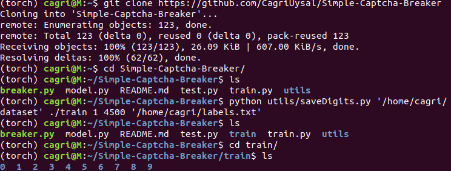 
<figcaption>Fig10. Training(1).</figcaption>
</figure>
</div>

<br/> After cloning the repo, we can use `saveDigits` to create necessary traing folder which contains 9 distinct folder for each digit. It's usage as follows:

`python saveDigits.py <dataset-path> <train-digits-path> <startIndex> <endIndex> <groundTruth-path>`

Here I used first 4500 images in the training (you can change the interval) and created `train` folder in the repo. If you are going to save the folder
in a different path, remember to change the root path in the `train.py`.

<div style="text-align:center"> 
<figure>
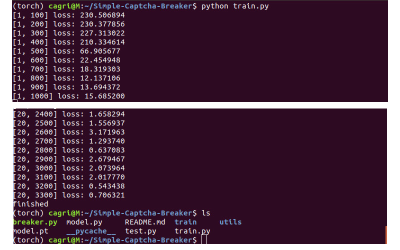 
<figcaption>Fig11. Training(2).</figcaption>
</figure>
</div>

<br/>Once we have train folder, we can run `train.py` to train our model. You will see `model.pt` in the folder when the training finish.

## Testing
Now it's time to evaluate our model's accuracy. 

```python
transform = transforms.Compose([transforms.Scale((24,14)),
    transforms.Grayscale(num_output_channels=1),
    transforms.ToTensor()])

dset = datasets.ImageFolder(root='test', transform=transform)
dloader = torch.utils.data.DataLoader(dset,
    batch_size=8, shuffle=True, num_workers=12)
```

`test.py` uses the same transformations as `train.py` and here only difference is, this time `ImageFolder` expects a folder named `test`.
As in the training part, we will create this folder using `saveDigits`.

```python
total = 0
correct = 0

net = torch.load('model.pt').to(device)
with torch.no_grad():
    for i, (inp,lab) in enumerate(dloader,0):
        inp = inp.to(device)
        lab = lab.to(device)

        # forward pass
        outs = net(inp)
        # convert output scores to predicted class
        _, pred = torch.max(outs,1)
        correct += (pred == lab).sum().item()
        total += lab.size(0)

print('Accuracy: %f %%' % (100*correct/total))
```

In the above code, the trained model is loaded to `net` variable. Because we don't need backprop while testing `torch.no_grad` is used to speed up computations.
The loop checks if the model predicts digits correctly and calculates the accuracy.

<div style="text-align:center"> 
<figure>
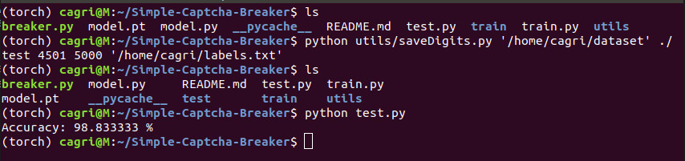 
<figcaption>Fig12. Testing.</figcaption>
</figure>
</div>

<br/> As in the training phase, we first created `test` folder using remaining images in the dataset. It is crucial to test the model
with data it has not seen before. This model achieves `98.8` percent accuracy.

The important thing to note here is achieved accuracy is per digit and not whole captcha. Thus single captcha has six digits inside, we can assume
`0.988^6=0.93` of the time model will predict the whole captcha correctly.

Using `breaker.py` we can break whole captchas. It's usage as follows:

`python breaker.py <image_file1> [<image_file2> ...]`

Let's give the first 5 test images and see the results.

<div style="text-align:center"> 
<figure>
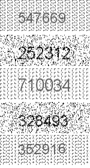 
<figcaption>Fig13. First five test captcha.</figcaption>
</figure>
</div>

<div style="text-align:center"> 
<figure>
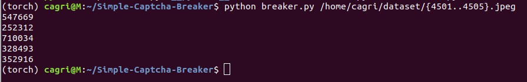 
<figcaption>Fig14. Results of breaker.</figcaption>
</figure>
</div>


<br/>And that's it. If you read this far I would like to thank you and I hope it has been helpful.
<br/><br/>Cheers.
